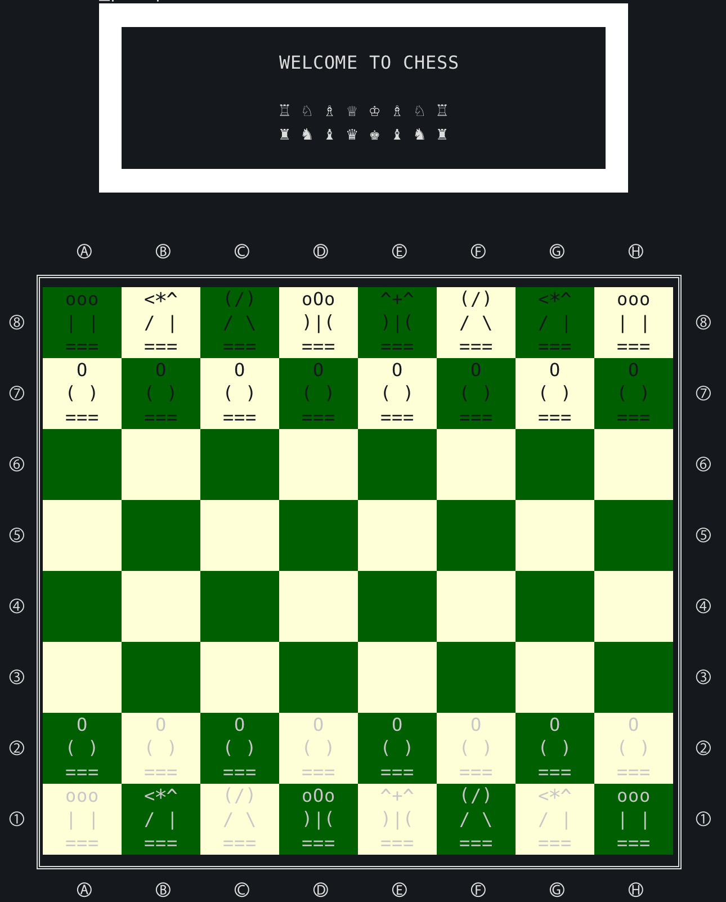

# chess-plusplus

This is a two-player game made with C++. Please make sure that 
your terminal of choice supports unicode!

# Compile Instructions:

Using CMake:

    1) mkdir build && cd build
    2) cmake ..